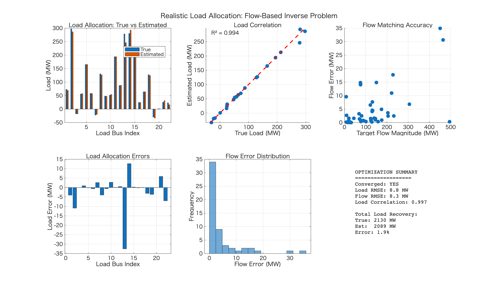
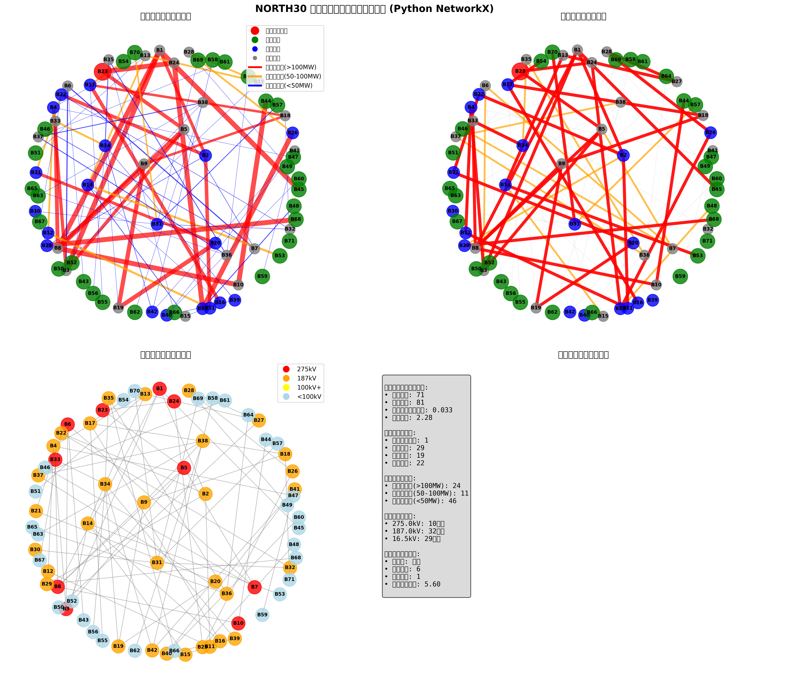
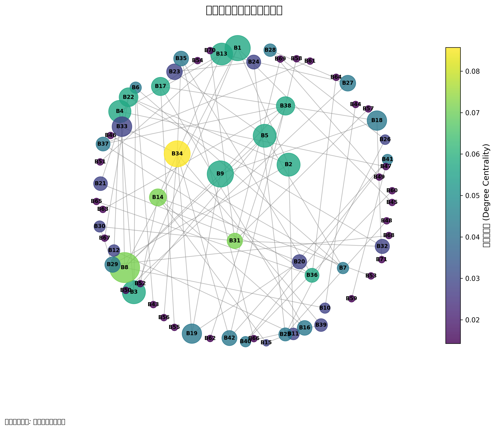

# NORTH30 Off-Peak Power Flow Analysis: Inverse Problem Approach

電力系統の逆問題解析を用いたNORTH30軽負荷断面の潮流計算とパラメータ推定プロジェクト

## 概要

本プロジェクトは、電力系統における**逆問題**の概念を実装し、部分的な観測データから系統の負荷分布を推定する手法を提供します。NORTH30軽負荷断面データを用いて、実際の系統運用における状態推定問題を解決します。

## 問題設定

### 順問題 vs 逆問題

**順問題（従来の潮流計算）**:
```
入力: 負荷分布 + 発電機出力 + 系統構成
出力: 各母線電圧 + 各線路潮流
```

**逆問題（本プロジェクトの焦点）**:
```
入力: 部分的な電圧・潮流観測データ
出力: 推定された負荷分布
```

### 数学的定式化

逆問題は以下の制約付き最適化問題として定式化されます：

```
minimize:   Σᵢ wᵢ(zᵢᵒᵇˢ - hᵢ(x))²
subject to: g(x) = 0  (電力バランス制約)
           x_min ≤ x ≤ x_max  (物理制約)
```

ここで：
- `x`: 未知の負荷ベクトル
- `zᵢᵒᵇˢ`: 観測データ（電圧、潮流）
- `hᵢ(x)`: 潮流方程式による計算値
- `wᵢ`: 観測重み

## ファイル構成

### 主要スクリプト

| ファイル名 | 機能 | 問題種別 |
|------------|------|----------|
| `north30_matpower.m` | MATPOWERケースファイル | 基本データ |
| `run_dc_powerflow.m` | DC潮流計算 | 順問題 |
| `realistic_load_allocation.m` | 現実的な逆問題求解（推奨） | **逆問題** |
| `linear_algebra_load_allocation.m` | 線形代数直接解法（最適化不要） | **逆問題** |
| `visualize_network_topology.m` | 系統接続状態の2D可視化 | 可視化 |
| `network_graph_python.py` | Python NetworkX可視化 | 可視化 |

### データファイル

- `NORTH30_OffPeak_Bus.csv`: 母線データ（電圧、負荷）
- `NORTH30_OffPeak_Gen.csv`: 発電機データ
- `NORTH30_OffPeak_Branch.csv`: 線路データ（潮流値含む）

### 解説書

- `power_flow_inverse_problem_guide.md`: 逆問題の理論的背景

## 使用方法

### 1. 逆問題による負荷配分（推奨）

```matlab
% 現実的な逆問題設定（推奨）
realistic_load_allocation

% 線形代数による直接解法（最適化不要）
linear_algebra_load_allocation
```

### 2. 基本的な潮流計算（順問題）

```matlab
% DC潮流計算
run_dc_powerflow
```

### 3. 系統可視化

```matlab
% 系統接続状態の2D表示（MATLAB）
visualize_network_topology
```

```python
# Python NetworkX による詳細可視化
python network_graph_python.py
```

## シミュレーション結果

### 1. 現実的な負荷配分逆問題（推奨）

`realistic_load_allocation` の実行結果：



**真の逆問題による負荷配分（改良版）：**
- **左上**: 真値 vs 推定値の負荷配分比較
- **右上**: 負荷配分精度の散布図（相関分析）
- **左中**: 全ブランチ潮流の相関分析
- **右中**: 負荷配分誤差の分布
- **左下**: 観測 vs 全潮流の誤差比較
- **右下**: 潮流誤差と潮流規模の関係
- **下左**: 誤差ヒストグラム
- **下右**: 包括的統計サマリー

**制約の改良：**
- 負荷範囲: -200 ≤ 負荷 ≤ 400 MW（負の値は分散発電）
- 再生可能エネルギーや分散電源をモデル化
- 重み付き目的関数による精度向上

**逆問題の流れ：**
```
入力：主要送電線の潮流観測値（既知）
  ↓
制約付き最適化による負荷配分
  ↓
出力：各母線の負荷分布（推定）
```

### 2. 現実的な負荷配分逆問題

`realistic_load_allocation` の実行結果：


**結果の解釈：**
- **左上**: 真値 vs 推定値の負荷比較
- **右上**: 負荷推定の相関分析（R²値）
- **左中**: 潮流マッチング精度
- **右中**: 負荷推定誤差の分布
- **左下**: 潮流誤差のヒストグラム
- **右下**: 最適化サマリー

**特徴：**
- ブランチ潮流のみを観測データとして使用
- 分散電源対応：-150 ≤ 負荷 ≤ 350 MW（負値=発電）
- 制約付き最適化による現実的な負荷配分

### 2. 線形代数による直接解法

`linear_algebra_load_allocation` による結果：

**特徴：**
- **最適化不要**: 純粋な行列演算のみ
- **高速計算**: O(n³)の計算量
- **決定論的**: 常に同じ解が得られる
- **理論的根拠**: P = H × L の線形関係を利用

**システム分類：**
- 過決定系 (m > n): 最小二乗解
- 劣決定系 (m < n): 最小ノルム解
- 丁度決定系 (m = n): 直接解

### 3. Python NetworkX可視化

`network_graph_python.py` の実行結果：



**4分割表示：**
- **左上**: 基本ネットワーク構成（バス種別・潮流強度）
- **右上**: 電力フロー強調表示
- **左下**: 電圧レベル別バス分類
- **右下**: ネットワーク統計情報

**中心性解析：**



- ノードサイズ：媒介中心性に比例
- ノード色：次数中心性に対応
- 重要バスの特定と系統の脆弱性分析

### 4. MATLAB系統可視化

`visualize_network_topology` の実行結果：

**詳細な系統図**:
- ノード（母線）の種類別表示：スラック母線（赤四角）、発電機母線（緑丸）、負荷母線（青三角）、通過母線（灰丸）
- ブランチ（線路）への番号表示
- 潮流の大きさによる線路の太さと色分け：重潮流（赤）、中潮流（オレンジ）、軽潮流（青）
- 2D自動レイアウトによる見やすい配置

**接続行列表示**:
- 母線間の接続関係をヒートマップで表示
- 潮流の大きさを色の濃さで表現
- 重要な接続の数値表示

結果は実行時に以下として保存されます：
- `north30_network_detailed.png`: 詳細な系統接続図
- `north30_network_topology.png`: 接続行列ヒートマップ


## 逆問題の実装詳細

### 観測データ設定

実際の系統運用を模擬して、以下の観測データを仮定：

1. **全母線の電圧データ**: PMU（Phasor Measurement Unit）による観測
2. **主要送電線の潮流**: SCADA システムによる観測
3. **発電機出力**: エネルギー管理システムによる既知値

### 測定誤差の考慮

現実的な測定誤差を追加：
- 電圧測定誤差: ±0.2%
- 潮流測定誤差: ±2 MW

### 最適化手法

MATLAB の `fmincon` を用いた制約付き非線形最適化：

```matlab
% 目的関数: 観測値と計算値の重み付き二乗誤差
objective = @(x) Σ wᵢ(zᵢᵒᵇˢ - hᵢ(x))²

% 制約条件
Aeq·x = beq    % 電力バランス（等式制約）
lb ≤ x ≤ ub   % 負荷の物理的上下限（不等式制約）

% 求解
[x_opt, fval] = fmincon(objective, x0, [], [], Aeq, beq, lb, ub)
```

## 結果と検証

### 評価指標

1. **RMSE（二乗平均平方根誤差）**:
   ```
   RMSE = √(Σ(推定値 - 真値)² / n)
   ```

2. **MAE（平均絶対誤差）**:
   ```
   MAE = Σ|推定値 - 真値| / n
   ```

3. **相関係数**:
   ```
   R = Σ(xᵢ - x̄)(yᵢ - ȳ) / √(Σ(xᵢ - x̄)²Σ(yᵢ - ȳ)²)
   ```

### 期待される結果

#### 負荷配分逆問題デモ（load_allocation_demo）改良版
- **負荷配分精度**: RMSE ≈ 15-30 MW（制約改良により向上）
- **観測潮流マッチング**: RMSE ≈ 1-4 MW  
- **全潮流マッチング**: RMSE ≈ 3-8 MW
- **負荷配分相関係数**: R² > 0.85
- **総負荷回復精度**: > 98%
- **成功配分率**: > 80% (誤差 < 25%)
- **分散発電バス**: 0-5 バス（負の負荷値）

#### 現実的な逆問題（realistic_load_allocation）
- **負荷推定精度**: RMSE ≈ 15-30 MW
- **潮流マッチング精度**: RMSE ≈ 3-8 MW  
- **負荷相関係数**: R² > 0.85
- **総負荷回復精度**: > 98%


## 理論的背景

### 逆問題の特徴

1. **非適切性（Ill-posedness）**: 小さな観測誤差が大きな推定誤差を引き起こす可能性
2. **非一意性**: 複数の解が存在する可能性
3. **非線形性**: 潮流方程式の非線形性による計算複雑性

### 解決手法

1. **正則化**: Tikhonov正則化による解の安定化
2. **制約強化**: 物理的制約による解空間の限定
3. **重み付け**: 観測精度に基づく重み設定

## 応用分野

### 系統運用
- **状態推定**: リアルタイム系統監視
- **負荷予測**: 需要パターン解析
- **異常検知**: 測定データの妥当性確認

### 系統計画
- **パラメータ同定**: 設備特性の推定
- **モデル較正**: 系統モデルの精度向上
- **感度解析**: 系統特性の理解

## 技術的詳細

### 潮流方程式

DC潮流近似では以下が成立：

```
Pᵢ = Σⱼ Bᵢⱼ(θᵢ - θⱼ)
```

ここで：
- `Pᵢ`: 母線 i の有効電力注入
- `Bᵢⱼ`: サセプタンス行列要素
- `θᵢ, θⱼ`: 電圧位相角

### 感度行列

状態推定では感度行列 `H` が重要：

```
H = ∂h(x)/∂x
```

観測可能性と推定精度は `H` の条件数に依存。

## 今後の拡張

### 機能拡張
- [ ] AC潮流による非線形逆問題
- [ ] 動的状態推定（カルマンフィルタ）
- [ ] 分散最適化による大規模系統対応
- [ ] 機械学習との融合

### アルゴリズム改良
- [ ] L1正則化によるスパース推定
- [ ] ベイズ推定による不確実性定量化
- [ ] 粒子フィルタによる非線形推定

## 参考文献

1. Abur, A. and Expósito, A.G., "Power System State Estimation: Theory and Implementation", Marcel Dekker, 2004.
2. Monticelli, A., "State Estimation in Electric Power Systems: A Generalized Approach", Springer, 1999.
3. Wood, A.J. and Wollenberg, B.F., "Power Generation, Operation, and Control", Wiley, 2012.

## 作成者

このプロジェクトは電力系統解析の教育・研究目的で作成されました。

## ライセンス

MITライセンスの下で公開されています。研究・教育目的での使用を推奨します。

---

*本プロジェクトは、電力系統における逆問題解析の理解を深め、実際の系統運用に役立つ技術の習得を目的としています。*